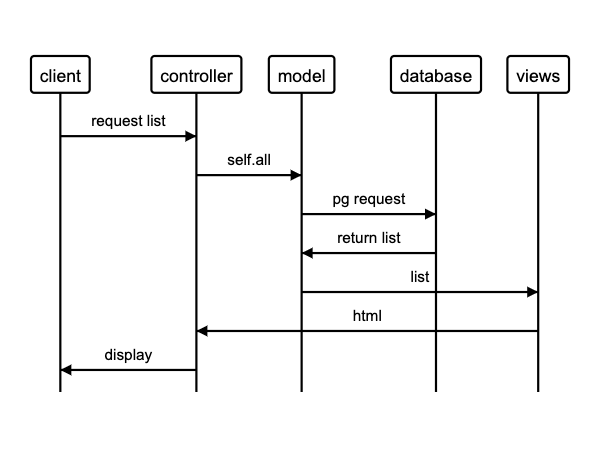

## MakersBnB

Week 6 Group Project utilising AGILE project management

### Team Members

Dillon, Ilja, Matteo, Paul and Ryan

### Project Specification

Create a web application named MakersBnB that allows users to list and hire available spaces.

### Technologies

- Written in Ruby
- Sinatra for handling requests and responses
- Capybara for featuring testing
- RSpec for unit testing
- PostgreSQL for the databases
- Ruby Gemfile ```pg``` for connecting and executing SQL on PostgreSQL databases
- Ruby Gemfile ```rubocop``` for code analysis and formatting

### Headline specifications

- Any signed-up user can list a new space.
- Users can list multiple spaces.
- Users should be able to name their space, provide a short description of the space, and a price per night.
- Users should be able to offer a range of dates where their space is available.
- Any signed-up user can request to hire any space for one night, and this should be approved by the user that owns that space.
- Nights for which a space has already been booked should not be available for users to book that space.
- Until a user has confirmed a booking request, that space can still be booked for that night.

### User Stories

```
As a User
So I can see what spaces are available for hire
I want to see a list of available spaces

As a User
So I can make a space available for hire
I want to be able to add my space to the list of available spaces

As a User
So I can make multiple spaces available for hire
I want to be able to add more than one space to the list of available spaces

As a User
So I and other users can tell spaces apart
I want each space to have a name

As a User
So other users can learn more about the space
I want each space to have a short description

As a User
So other users know how much it will cost to hire
I want each space to have a price per night

As a User
So I can use MakersBnB
I need to sign up as a user

As a User
So other users know whether a space is available
I want each space to show it's availability

As a User
So I can control when a space is available or not
I want to be able to change availability depending on date
```
#### MVC Diagram



#### Setup Databases
Connect to postgres, then create database:

```
psql postgres;
CREATE DATABASE makersbnb;
```

connect to database using command:
```
\c makersbnb;
```

For test database: connect to postgres, then create database:

```
psql postgres;
CREATE DATABASE makersbnb_test;
```

Connect to database using command:

```
\c makersbnb_test;
```

Spaces and Users table:

connect to database using command:
```
\c makersbnb;
```

Follow steps in migrations for building each table:
Spaces:
1. db/migrations/01_create_spaces_table.sql -> to create spaces table
2. db/migrations/02_add_descriptions_column.sql -> to add a description column to spaces
3. db/migrations/03_add_price_column.sql -> to add a price column to spaces
4. db/migrations/07_add_userid_column.sql -> to add a foreign key (user_id) column
Users:
1. db/migrations/04_create_users_table.sql -> to create users table
2. db/migrations/05_alter_password_length_limit.sql -> to lengthen password limit to allow for hashing
3. db/migrations/06_alter_email_length_limit.sql -> to lengthen email limit
Dates:
1.
2.

### Initial Planning

#### Group Goal
- [x] Create Minimum Viable Product by end of day 2.

#### MVP
A webpage that lists spaces available for hire.
A place can be added to a list via the website.
